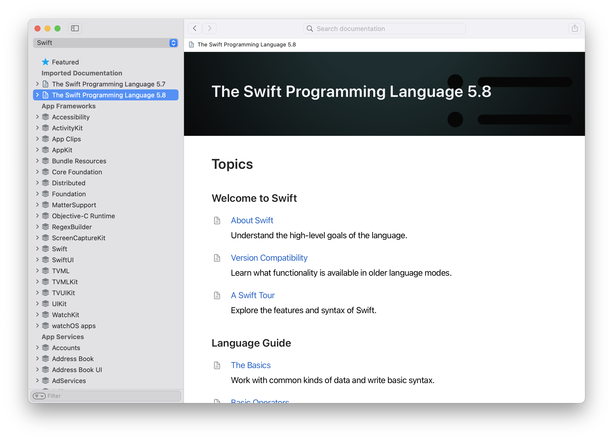

# TSPL-doccarchive

Visit the history versions of [TSPL(The Swift Programming Language)](https://github.com/apple/swift-book) with ease.



## Why?

- want to read the different stable version of TSPL
- want to read TSPL offline (which is necessary when network conditions are poor)

## Requirements

- Xcode 14 or later

## Usage

### Installation

```shell
# 1. clone this repo

# 2. build the version you want
$ ./build.sh 5.7
$ ./build.sh 5.8
# ...

# 3. open the .doccarchive file in dist/
```

Visit the Imported Documentation in `Xcode > Help > Developer Documenation`

### Uninstallation

Remove the files in `dist/`, `Xcode > Help > Developer Documenation` will detect changes and remove related entries from itself.

## FAQ

### Why you doesn't provide docs piror to version 5.7?

Starting from version 5.7, Swift began using [DocC](https://github.com/apple/swift-docc) to build documentation. This project doesn't plan to support documentation building tools other than DocC.

## License

[Apache License 2.0](http://www.apache.org/licenses/LICENSE-2.0)
